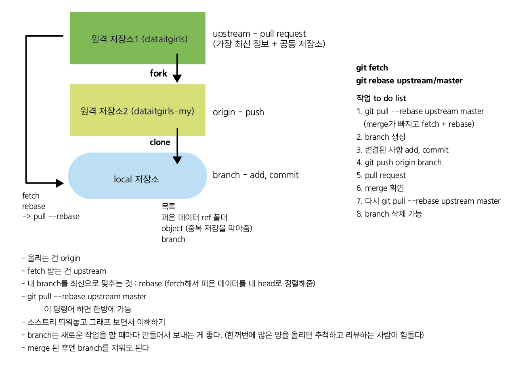
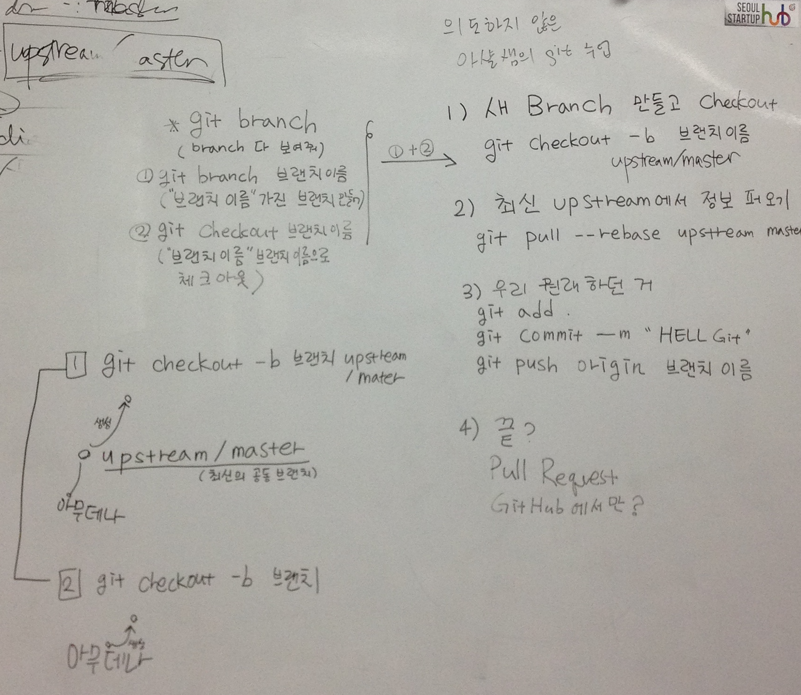

Git 
- 형상 관리
- 타임 머신: 평행 우주 중 하나로 간다

Branch
- 동시에 여러 작업 각각 수행: branch (선풍기 날개, 받침)
- 각각 작업한 것을 통합: merge (날개+받침)
- 일을 작게작게 나눠서 여러 개의 branch를 만들어가며 하는 것이 좋음

Pull Request 
- pull = fetch & merge
- request : 내 **브랜치**(가 준비되어 있으니 이거)를 받아서 합쳐줘
- 여기서 말하는 브랜치는 reference이므로 내용이 바뀔 수 있다. 컴퓨터는 현 시점에서의 브랜치로 받아들임. 이 브랜치는 로컬이 아니라 리모트(내 깃허브)에 있어야 한다.

Remote 
- git remote : 나에게 등록된 원격저장소를 모두 보여줘
- git remote add upstream 데잇걸즈주소
- git fetch upstream : upstream(데잇걸즈 TIL repository)에서 최신 버전을 가져온다.

Rebase
- rebase : base(head)의 위치를 바꾼다. 
- git pull origin master : origin에 있는 걸 fetch하고 merge해라
- git pull —rebase origin master : fetch + rebase -> 불필요한 merge가 안 일어남
- git pull —rebase upstream master (git status에 아무것도 없어야한다)
- git rebase —continue

 

[1] 다 같이 쓰는 원격 저장소 - upstream이라는 이름이 붙는다 - upstream/master
 [2] 내가 쓰는 원격 저장소 - clone하면서 origin이라는 이름이 붙는다 - origin/branch 
 [3] 나의 로컬 저장소 - 목록(퍼온데이터/objects) - branch
- **fetch는 [1]에서 [3]으로**
- **올리는 것은 한 번에 안 된다. add -> commit -> [3]에서 [2]로 push -> [2]에서 [1]로 pull request**

 

